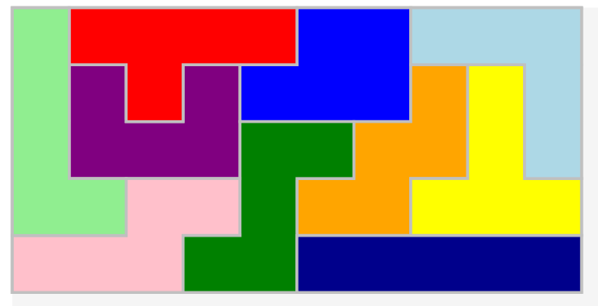
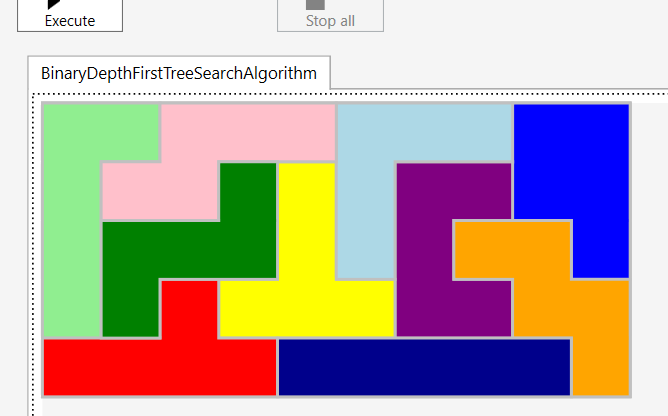

# Overall description
Tree-search-based and genetic-based algorithms having some science-article-based and custom improvements, with
agnostic execution wrapper, provided together with geometric and binary verifiers. Suitable for solving tangrams
as well as other games like listed below:
```
The GENIUS Star
The GENIUS Square
The GENIUS Junior
```
# Example solutions - binary depth-first solver



# Some usefull information
## Online polygons creator
```
https://www.mathsisfun.com/geometry/polygons-interactive.html
```

## Tutorials
```
https://diegogiacomelli.com.br/function-optimization-with-geneticsharp/
```

## Github pages
```
https://github.com/leprekon91/tangram-ga/blob/master/tangram-ga/tangram.py
https://github.com/giacomelli/GeneticSharp/blob/master/src/GeneticSharp.Domain/Mutations/UniformMutation.cs
```

## Forked repos
'Experimental' prefixed projects are forked.
The algorithm is there explicitly defined in 
hard-coded way.

# Detailed description
The WPF presenter is a demo only, which is helpfull for check correctness of the algorithm in a visual way.
There are some minor bugs in code which have to be solved like null reference exceptions 
caused by incorrect input data etc, but it is all about quick fixes.

Besided that the solver is fully functional having two groups of algorithms: tree search based
with variations and genetic based with variations.

There is a generic game set implemented and one real game bought in Poland(please see PolishBigBoard).

To have the Genius games implemented please use the isEnabled flag already added to the Board class.

# Conclusions
## Science Ideas
- Reimplement the nettopologysuitenet in a form of GPGPU.
- use all devices from the laptop for permutation-type calculations(mainly GPU),

## Business Ideas
- create platform for defining Your own game based on avalaible game templates: image recgonition etc, for example:
	-- how many torches You need and how many moves Youe have to do to have n triangles and m rectangles 
	-- board with x and y size and blocks 
	-- as above with mesh
	-- as above and 3D version
- as a user You need to login, order game and wait for the solution even couple of days,
 then You are free to play, share with friends, and You are free to use game money to
 use the advisor mode(undo already used item or which item has to be next etc.)
 or do the separation of funcionalities and release many single games with the same engine
 and advisor mode.
