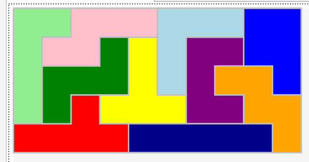

# Startup project name 
```
Experimental.MVVM.WPF.Presenter.csproj 
```
# Overall description
Tree-search-based and genetic-based algorithms having some science-article-based and custom improvements, with
agnostic execution wrapper, provided together with geometric and binary verifiers. Suitable for solving tangrams
as well as other games like listed below:
```
Smart games PuzzlePro
Smart games IQ xoxo
The GENIUS Star
The GENIUS Square
The GENIUS Junior
```
# Sample solutions - binary depth-first solver



# Some useful information
## Online polygons creator
```
https://www.mathsisfun.com/geometry/polygons-interactive.html
```

## Tutorials
```
https://diegogiacomelli.com.br/function-optimization-with-geneticsharp/
```

## Github
```
https://github.com/leprekon91/tangram-ga/blob/master/tangram-ga/tangram.py
https://github.com/giacomelli/GeneticSharp/blob/master/src/GeneticSharp.Domain/Mutations/UniformMutation.cs
```

## Forked repos
'Experimental' prefixed projects are forked.

# TODOs
The WPF presenter is a demo only, which is helpfull for check correctness of the algorithm in a visual way.
There are some minor bugs in code which have to be solved like null reference exceptions 
caused by incorrect input data etc, but it is all about quick fixes.

Besides that the solver is fully functional, having two groups of algorithms: tree search based
with customizations and genetic based with customizations.

There is a generic game set implemented and the one reflected real game bought in Poland(please see IQ xoxo).

To have the Genius games implemented please use the isEnabled flag already added to the Board class.

